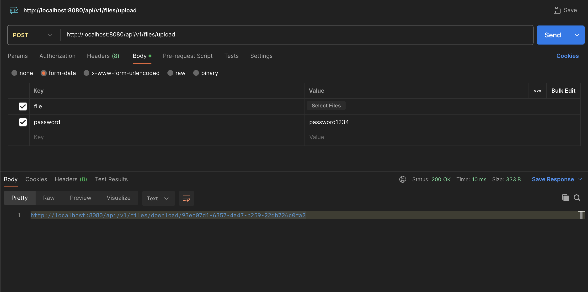
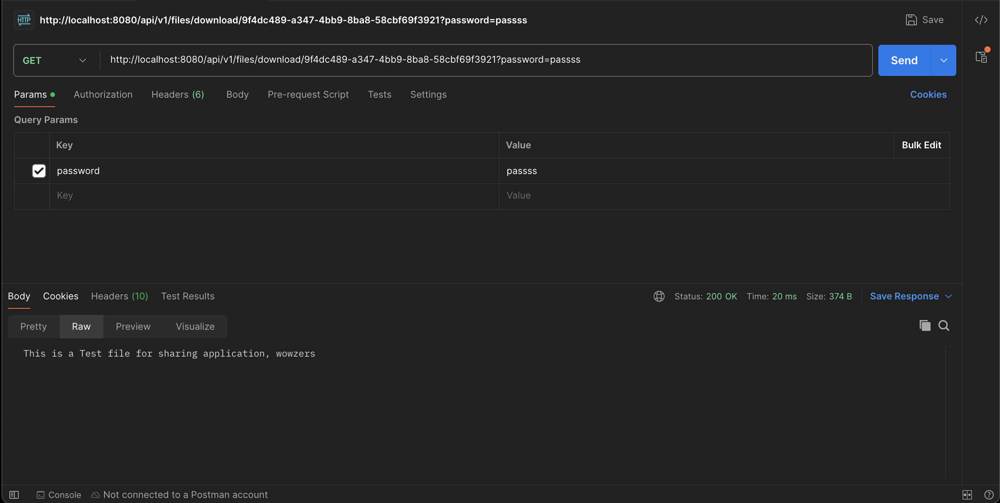

**This is a simple file sharing REST API Application.**

## Currently available APIs

1. `/api/v1/files/upload - POST`

Upload a File and get a Shareable URL

Request Body - FormData

```
file: `File to be Uploaded`
password: "password1234"
```

Response
`http://localhost:8080/api/v1/files/download/93ec07d1-6357-4a47-b259-22db726c0fa2`

Example



2. `/api/v1/files/download/{url} - GET`

Download a Secure File from the Server after providing the password

Request Params

`password="password1234"`

Response

**BLOB Data Shared Over Server, File if exists will be downloaded**

Example


